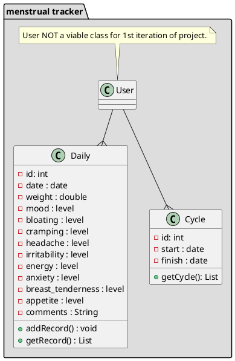

### uml: class diagram

```plantuml
@startuml
package "menstrual tracker" #DDDDDD {
    
    class User {

    }
    
    class Daily {
        - id: int
        - date : date
        - weight : double
        - mood : level
        - bloating : level
        - cramping : level
        - headache : level
        - irritability : level
        - energy : level
        - anxiety : level
        - breast_tenderness : level
        - appetite : level
        - comments : String
        + addRecord() : void
        + getRecord() : List
    }
    
    class Cycle {
        - id: int
        - start : date
        - finish : date
        + getCycle(): List
    }

    User --{ Cycle
    User --{ Daily

    note top of User 
        User NOT a viable class for 1st iteration of project.
    end note
   
}
@enduml
```