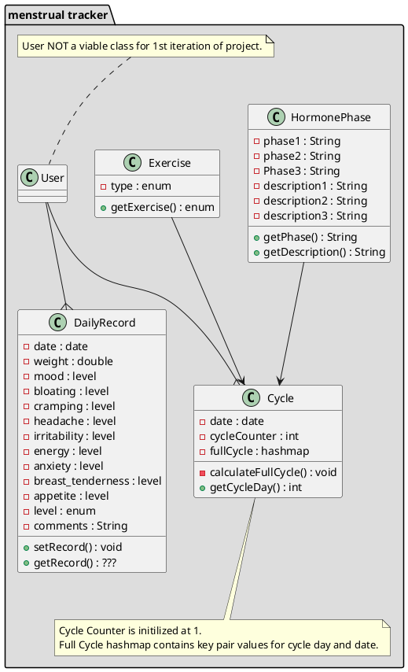

### uml: class diagram

```plantuml
@startuml
package "menstrual tracker" #DDDDDD {
    
    class User {

    }
    
    class DailyRecord {
        - date : date
        - weight : double
        - mood : level
        - bloating : level
        - cramping : level
        - headache : level
        - irritability : level
        - energy : level
        - anxiety : level
        - breast_tenderness : level
        - appetite : level
        - level : enum
        - comments : String
        + setRecord() : void
        + getRecord() : ???
    }
    
    class Cycle {
        - date : date
        - cycleCounter : int
        - fullCycle : hashmap
        - calculateFullCycle() : void
        + getCycleDay() : int
    }

    class HormonePhase {
        - phase1 : String
        - phase2 : String
        - Phase3 : String
        - description1 : String
        - description2 : String
        - description3 : String
        + getPhase() : String
        + getDescription() : String
    }

    class Exercise {
        - type : enum
        + getExercise() : enum
    }

    User --{ Cycle
    User --{ DailyRecord
    HormonePhase --> Cycle
    Exercise --> Cycle

    note top of User 
        User NOT a viable class for 1st iteration of project.
    end note

    note bottom of Cycle 
        Cycle Counter is initilized at 1.
        Full Cycle hashmap contains key pair values for cycle day and date.
    end note
   
}
@enduml
```